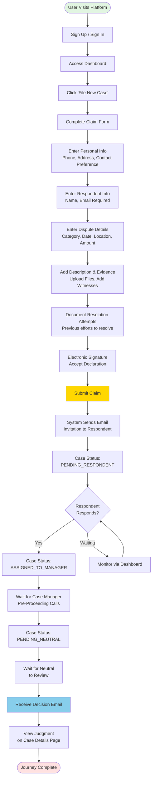
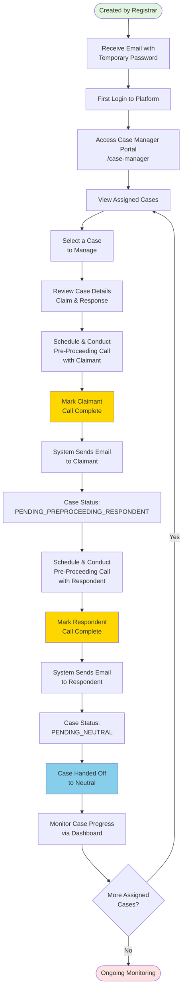
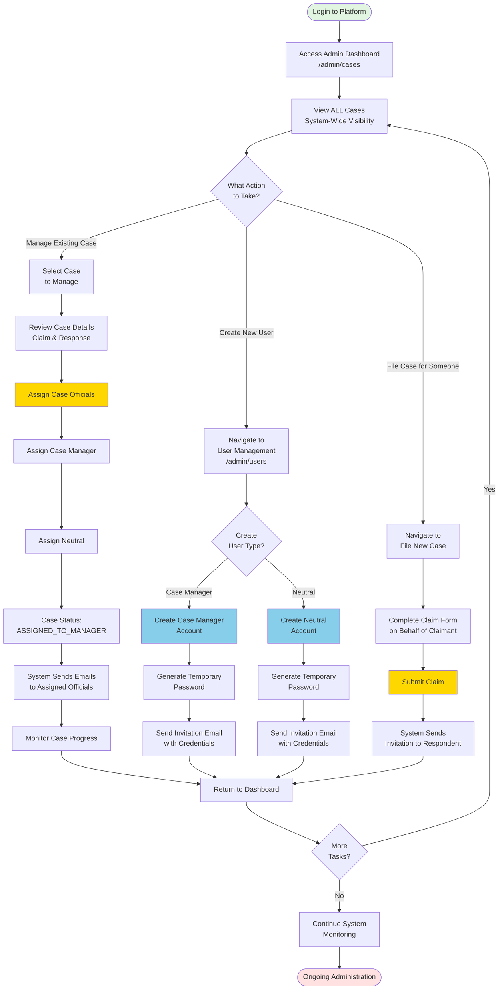
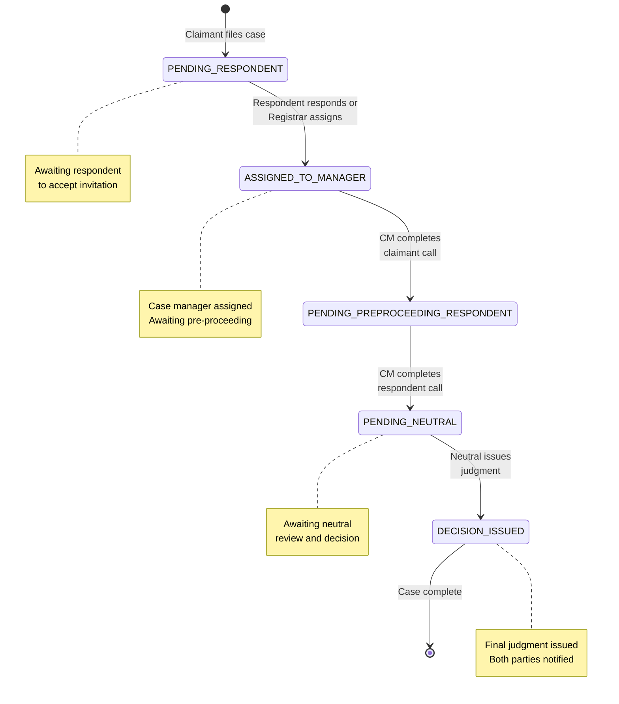
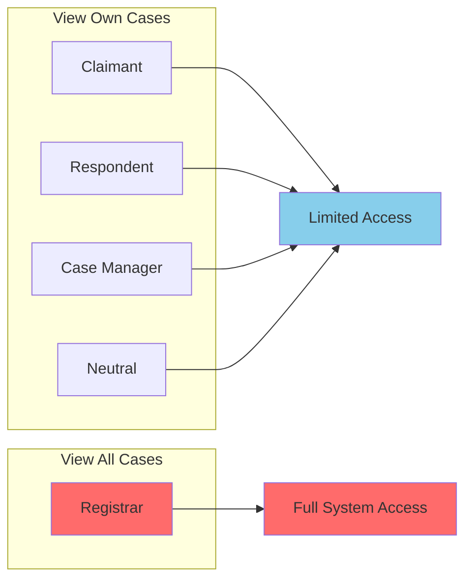

# User Journey Diagrams - Dispute Resolution Platform

This document contains user journey diagrams for all five user personas in the platform.

---

## 1. CLAIMANT Journey



**Key Touchpoints:**
- Dashboard → File New Case → Form Submission → Case Tracking → Decision Receipt
- Receives automated emails at key milestones
- Primary action: Filing comprehensive claim form

---

## 2. RESPONDENT Journey

```mermaid
graph TD
    Start([Receive Email Invitation]) --> ClickLink[Click Invitation Link<br/>with Token]

    ClickLink --> CheckAuth{Already<br/>Registered?}
    CheckAuth -->|No| AutoRegister[System Auto-Creates Account<br/>with Temporary Password]
    CheckAuth -->|Yes| Login[Sign In]

    AutoRegister --> EmailCreds[Receive Credentials Email]
    EmailCreds --> FirstLogin[First Login with<br/>Temp Password]
    FirstLogin --> ViewCase[View Case Details]

    Login --> ViewCase
    ViewCase --> ReadClaim[Read Claimant's<br/>Request & Details]
    ReadClaim --> DecideResponse{Respond to<br/>Claim?}

    DecideResponse -->|Yes| RespondForm[Navigate to Respond Page<br/>/cases/[id]/respond]
    DecideResponse -->|No| Ignore[Ignore - No Response]
    Ignore --> End1([Case May Proceed<br/>Without Response])

    RespondForm --> FillResponse[Submit Response<br/>to Claimant's Request]
    FillResponse --> SubmitResponse[Submit Response]
    SubmitResponse --> StatusChange[Case Status Changes:<br/>ASSIGNED_TO_MANAGER]

    StatusChange --> TrackCase[Monitor Case<br/>via Dashboard]
    TrackCase --> Wait1[Wait for Case Manager<br/>Pre-Proceeding Call]
    Wait1 --> PreProceeding[Participate in<br/>Pre-Proceeding Call]
    PreProceeding --> Wait2[Wait for Neutral<br/>Review]

    Wait2 --> ReceiveDecision[Receive Decision Email]
    ReceiveDecision --> ViewDecision[View Judgment<br/>on Case Page]
    ViewDecision --> End2([Journey Complete])

    style Start fill:#e1f5e1
    style End1 fill:#ffe1e1
    style End2 fill:#ffe1e1
    style SubmitResponse fill:#ffd700
    style ReceiveDecision fill:#87ceeb
```

**Key Touchpoints:**
- Email Invitation → Auto-Registration → Case Review → Response Submission → Pre-Proceeding → Decision
- May receive temporary credentials via email
- Primary action: Submitting response to claim

---

## 3. CASE_MANAGER Journey



**Key Touchpoints:**
- Account Creation → Login → View Cases → Pre-Proceeding Calls → Handoff to Neutral
- Conducts two separate pre-proceeding calls
- Primary action: Facilitating pre-proceeding discussions

---

## 4. NEUTRAL (Mediator/Arbitrator) Journey

```mermaid
graph TD
    Start([Created by Registrar]) --> ReceiveEmail[Receive Assignment<br/>Notification Email]
    ReceiveEmail --> FirstLogin[Login with<br/>Temporary Password]

    FirstLogin --> Portal[Access Neutral Portal<br/>/neutral]
    Portal --> ViewAssigned[View Assigned Cases<br/>Status: PENDING_NEUTRAL]

    ViewAssigned --> SelectCase[Select Case<br/>to Review]
    SelectCase --> ReviewCase[Review Complete<br/>Case Details]

    ReviewCase --> Review1[Read Claimant's<br/>Request & Evidence]
    Review1 --> Review2[Read Respondent's<br/>Response]
    Review2 --> Review3[Review Pre-Proceeding<br/>Call Notes if any]

    Review3 --> ConsiderDecision[Consider Fair<br/>and Just Decision]
    ConsiderDecision --> GenerateJudgment[Click 'Generate Judgment'<br/>AI-Powered Decision]

    GenerateJudgment --> AIProcess[Llama 3.2 Model<br/>Analyzes Both Positions]
    AIProcess --> JudgmentCreated[Comprehensive Decision<br/>Generated]

    JudgmentCreated --> ReviewJudgment[Review Generated<br/>Judgment]
    ReviewJudgment --> SaveDecision[Decision Auto-Saved<br/>to Database]
    SaveDecision --> StatusChange[Case Status:<br/>DECISION_ISSUED]

    StatusChange --> NotifyParties[System Sends Emails<br/>to Both Parties]
    NotifyParties --> CaseComplete[Case Completed]

    CaseComplete --> MoreCases{More Cases<br/>to Review?}
    MoreCases -->|Yes| ViewAssigned
    MoreCases -->|No| End([Ongoing Monitoring])

    style Start fill:#e1f5e1
    style End fill:#ffe1e1
    style GenerateJudgment fill:#ffd700
    style NotifyParties fill:#87ceeb
    style AIProcess fill:#dda0dd
```



**Key Touchpoints:**
- Account Creation → Assignment → Case Review → AI Judgment Generation → Decision Issuance
- Uses AI to generate fair, reasoned decisions
- Primary action: Issuing final judgment

---

## 5. REGISTRAR (Administrator) Journey



**Key Touchpoints:**
- Login → System Overview → Case Assignment / User Creation / Case Filing → Monitoring
- Has access to all system functions
- Primary actions: Assigning cases, creating users, system oversight

---

## Complete Case Flow (All Personas)

```mermaid
graph TD
    subgraph "Filing Stage"
        A1[CLAIMANT<br/>Files New Case] --> A2[Complete Claim Form]
        A2 --> A3[Submit Claim]
        A3 --> A4[Status: PENDING_RESPONDENT]
    end

    subgraph "Response Stage"
        A4 --> B1[System Emails<br/>RESPONDENT]
        B1 --> B2[RESPONDENT<br/>Receives Invitation]
        B2 --> B3{Responds?}
        B3 -->|Yes| B4[Submit Response]
        B3 -->|No| B5[Case Proceeds<br/>Anyway]
        B4 --> B6[Status: ASSIGNED_TO_MANAGER]
        B5 --> B6
    end

    subgraph "Assignment Stage"
        B6 --> C1[REGISTRAR<br/>Assigns Officials]
        C1 --> C2[Assign Case Manager]
        C2 --> C3[Assign Neutral]
        C3 --> C4[Notify Assigned Staff]
    end

    subgraph "Pre-Proceeding Stage"
        C4 --> D1[CASE MANAGER<br/>Conducts Calls]
        D1 --> D2[Call with Claimant]
        D2 --> D3[Mark Complete]
        D3 --> D4[Status: PENDING_PREPROCEEDING_RESPONDENT]
        D4 --> D5[Call with Respondent]
        D5 --> D6[Mark Complete]
        D6 --> D7[Status: PENDING_NEUTRAL]
    end

    subgraph "Decision Stage"
        D7 --> E1[NEUTRAL<br/>Reviews Case]
        E1 --> E2[Generate AI Judgment]
        E2 --> E3[Issue Decision]
        E3 --> E4[Status: DECISION_ISSUED]
        E4 --> E5[Email Both Parties]
    end

    subgraph "Completion Stage"
        E5 --> F1[CLAIMANT & RESPONDENT<br/>View Decision]
        F1 --> F2[Case Closed]
    end

    style A1 fill:#e1f5e1
    style B2 fill:#e1f5e1
    style C1 fill:#e1f5e1
    style D1 fill:#e1f5e1
    style E1 fill:#e1f5e1
    style F2 fill:#ffe1e1
    style E2 fill:#dda0dd
```



---

## User Interaction Matrix

| Stage | Claimant | Respondent | Case Manager | Neutral | Registrar |
|-------|----------|------------|--------------|---------|-----------|
| **Filing** | ⭐ Primary Actor | - | - | - | Can file on behalf |
| **Invitation** | - | ⭐ Primary Actor | - | - | - |
| **Assignment** | Receives notification | Receives notification | ⭐ Gets assigned | ⭐ Gets assigned | ⭐ Primary Actor |
| **Pre-Proceeding** | Participates | Participates | ⭐ Primary Actor | - | Monitors |
| **Decision** | Receives decision | Receives decision | Monitors | ⭐ Primary Actor | Monitors |
| **Ongoing** | Monitors case | Monitors case | Monitors case | Monitors case | ⭐ Oversees all |

---

## Key Email Touchpoints

### Automated Emails Sent:

1. **Claimant → Respondent**: Invitation to respond to case
2. **Registrar → Case Manager**: Assignment with temporary credentials
3. **Registrar → Neutral**: Assignment with temporary credentials
4. **Case Manager → Claimant**: Pre-proceeding call completed
5. **Case Manager → Respondent**: Pre-proceeding call completed
6. **Neutral → Both Parties**: Decision issued notification

---

## Platform Features by Persona

### 🔵 Claimant
- File new cases
- Track case status
- View filed cases
- Upload evidence
- Receive decision

### 🟢 Respondent
- Auto-registration via invitation
- Respond to claims
- View case details
- Track status
- Receive decision

### 🟡 Case Manager
- View assigned cases only
- Conduct pre-proceeding calls
- Mark call completion
- Send notifications
- Track case progress

### 🟣 Neutral
- View assigned cases only
- Review full case details
- AI-powered judgment generation
- Issue decisions
- Notify parties

### 🔴 Registrar (Admin)
- View ALL cases system-wide
- Assign case managers
- Assign neutrals
- Create new users (CM & Neutral)
- File cases on behalf of others
- Complete system oversight

---

## Case Status Progression



---

## Access Control Summary



---

## Technology Stack Used in Journeys

- **Frontend**: Next.js 14, React, TailwindCSS
- **Backend**: Next.js API Routes, Prisma ORM
- **Database**: PostgreSQL
- **Authentication**: NextAuth.js with JWT
- **AI**: Llama 3.2 (via Ollama) for judgment generation
- **Email**: Nodemailer for automated notifications
- **Password**: bcrypt for hashing

---

*Generated on 2025-11-16*
