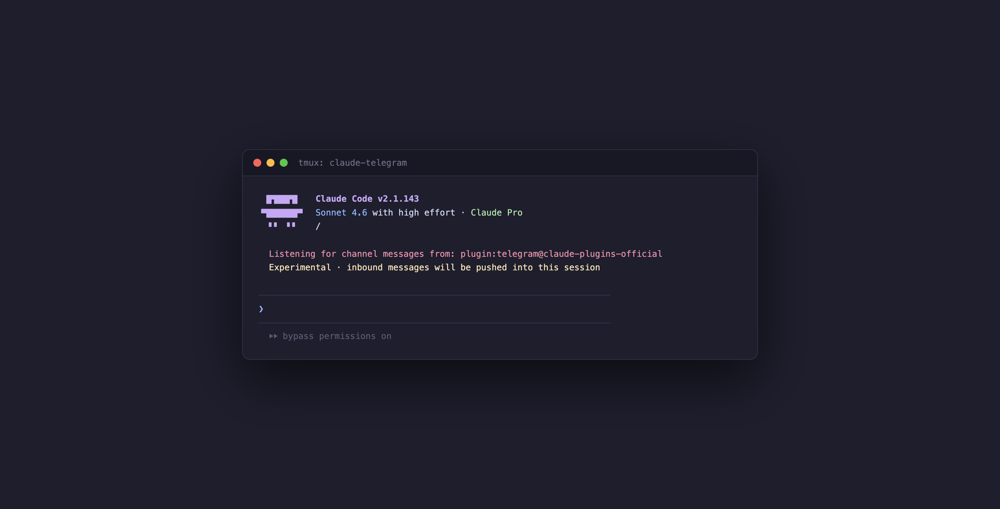
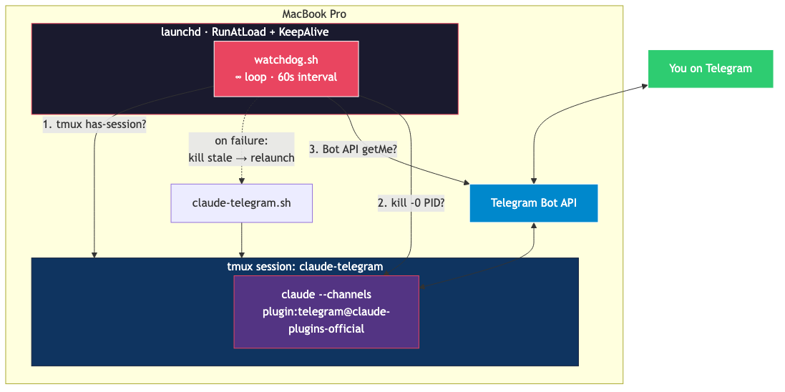
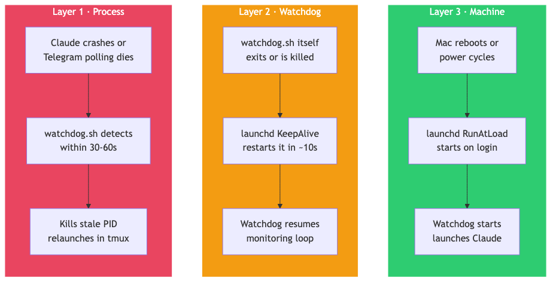

I wanted Claude on my phone. Not a wrapper, not a web UI — the actual Claude Code agent, with all my tools and context, reachable over Telegram.

Claude Code has a Telegram plugin for exactly this. You run `claude --channels plugin:telegram@claude-plugins-official`, pair your account, and suddenly you can message Claude from anywhere.

The problem: it kept dying.

Crash it once, it's gone. Reboot your Mac, it's gone. And since it runs as a foreground process, the moment you close the terminal, it's gone.

So I built a watchdog.



---

## The constraint that changes everything

Claude Code is a TUI app — it needs a real terminal (a TTY) to run. You can't just start it as a background daemon directly under launchd. It fails silently.

The fix: tmux. Run Claude inside a tmux session, and launchd manages the watchdog that watches that session.

```
launchd → watchdog.sh → tmux session → claude --channels
```

This is the core architecture. Everything else is consequence.



---

## Three layers of self-healing

I didn't want to ever think about this again, so I designed for complete autonomy:

**Layer 1 — Process**: `watchdog.sh` loops every 60 seconds and runs three checks:
1. Is the tmux session alive?
2. Is the Claude PID alive inside it?
3. Does the Telegram Bot API respond to a `getMe` call?

If any check fails, it kills the stale session and relaunches.

**Layer 2 — Watchdog**: The watchdog itself runs under launchd with `KeepAlive: true`. If `watchdog.sh` crashes or exits for any reason, launchd restarts it within ~10 seconds.

**Layer 3 — Machine**: The launchd agent has `RunAtLoad: true`. Reboot your Mac, log in, and within 60 seconds Claude is back on Telegram. No manual steps.

The only failures that still require human intervention: OAuth token expiry and bot token revocation. Everything else recovers automatically in 10–120 seconds.



---

## Two bugs I hit that weren't obvious

**Bug 1: Don't use `getUpdates` as your health check.**

My first instinct for the Telegram health check was to call `getUpdates` — if it returns updates, the bot is alive. Seems reasonable.

Wrong. Telegram only allows *one* long-poll consumer per bot token. The Claude plugin already holds that connection. When my watchdog called `getUpdates`, Telegram rejected it with a conflict error — and worse, it kicked the plugin's own connection, causing exactly the failure I was trying to detect.

The fix: `getMe` instead. It's a read-only endpoint that doesn't compete with the plugin's polling loop.

**Bug 2: `pgrep` is dangerous when you're running multiple bots.**

The original version cleaned up stale processes with:
```bash
pkill -f "claude.*channels.*telegram"
```

This killed every Claude channels process on the machine — including a completely separate bot (`cc-sdas`) that had nothing to do with this watchdog.

The fix: track only your own PID. The launcher writes its process ID to a file. The watchdog reads that file and only ever kills that specific PID. No pattern matching, no collateral damage.

---

## Exponential backoff

If something is fundamentally broken — say, OAuth expired — you don't want the watchdog hammering restarts every 60 seconds forever. So failures back off:

- 1st failure → restart, wait 30s
- 2nd failure → restart, wait 60s
- 3rd+ failure → restart, wait 120s (capped)
- On recovery → reset to normal interval

This prevents restart storms while still recovering reasonably fast when the underlying issue is fixed.

---

## What I'd do differently

One thing I didn't solve: Claude shows a "Do you trust this project?" prompt on first launch in a new tmux session, because the working directory defaults to `/`. It waits for Enter — silently blocking startup. The workaround is `tmux send-keys -t claude-telegram Enter`, but the real fix is launching from `~` or pre-trusting the directory.

Also worth noting: this whole setup assumes your Mac stays on and logged in. The battery-dying scenario is genuinely unrecoverable without physical intervention. If you want true 24/7 availability, you'd need a VPS instead of a local Mac. For my use case (it's my own machine), this is good enough.

---

## The repo

Everything is at [github.com/ucalyptus/claude-tmux-watchdog](https://github.com/ucalyptus/claude-tmux-watchdog) — the launcher, watchdog, health check script, and launchd plist. Should work on any Mac running Claude Code with the Telegram plugin.

If you're running Claude Code and want it reachable from your phone without babysitting it, this is the setup.
